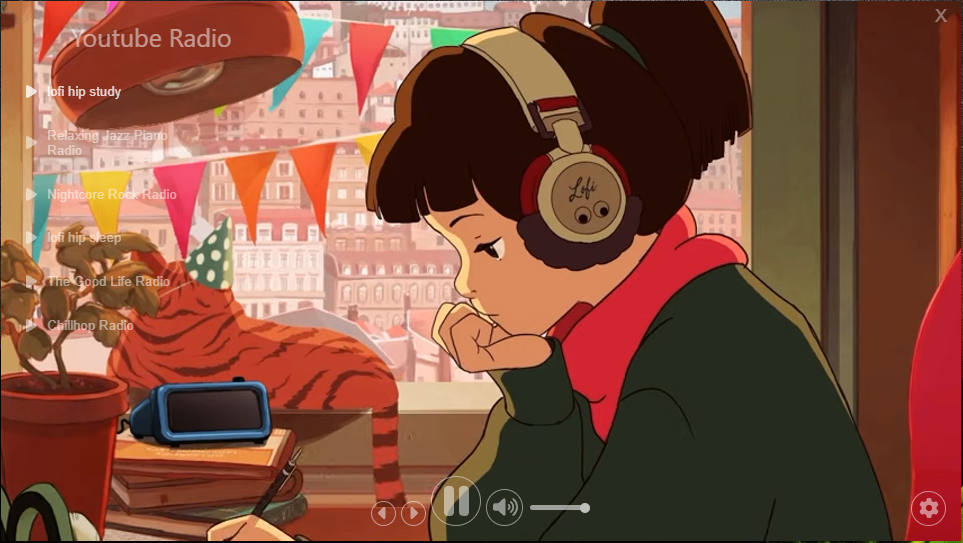
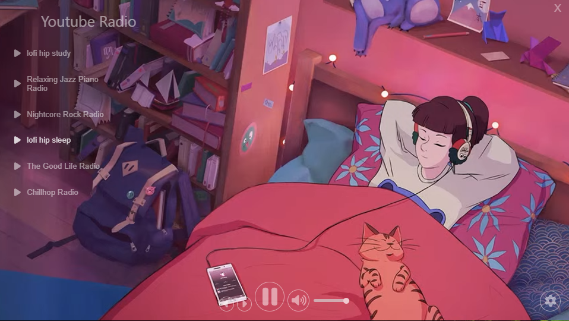

# youtube-radio

App with a clean ui that let you watch diferent youtube radio livestreaming in one place.
Based in the original work from [Adam Patrick](https://github.com/adamPatrick12) [StudyBeatsFM](https://github.com/adamPatrick12/study-beats-fm).

## Tools
- React.
- Electron.
- Font awesome.
- Framer motion.

## Dependencies

- npm add @electron/remote
- npm add electron concurrently wait-on cross-env
- npm i --save react-native-svg # **
- npm i -S @fortawesome/react-fontawesome
- npm i -S @fortawesome/fontawesome-svg-core
- npm i -S @fortawesome/free-solid-svg-icons
- npm i -S @fortawesome/free-regular-svg-icons
- npm i -S @fortawesome/fontawesome-common-types
- npm install react-player
- npm install framer-motion
- npm install simplebar-react --save
- npm install --save-dev @types/electron

## Known problems

- you can add new songs but not delet them.
- the close button is not working due to a problem with typescript and electron.

## Pictures

